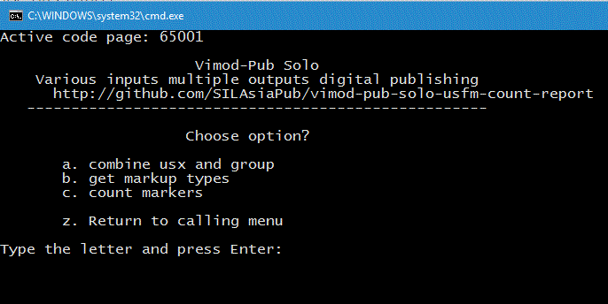

# vimod-pub-solo-usfm-count-report
Generate a report of USFM markers used in Paratext project from the USX files

This project is set up to make a HTML report on USFM markers used per book. It makes use of the Vimod-Pub scripting menus and tasks. If you want to make multiple reports this is not the best way to do it.

This is a Vimod-Pub solo project. If you want to make multiple Concordance, then it is best to use the Vimod-Pub project. http://projects.palaso.org/projects/vimod-pub

To use this project:

* You must have Java installed and either:
  * in the path 
  * or edit "pub\setup\user_installed_tools.var" and change the line 
      * # java=C:\Program Files\Java\jre8\bin\java.exe
      * change by removing the # and putting in your path to Java. i.e. replace the bit in [] brackets.
      * java=C:\[your-java-path]\bin\java.exe
* Export the USX files from Paratext. Tools/Advanced/Export project to USX
    * Select a folder and click OK
    * Copy the files into the usx folder in this project.
* Now open the project.tasks file.
* Edit the variables values in double quotes to suit your project. Don't forget the path you exported your USX to.
* Start pub.cmd by double clicking on it from Windows Explorer. You should see the following
  * 
  * If you don't see the above, check Java is installed as above.
* Type the letter a and press enter to move the files into the project.
* Now step through each of the other steps.
* If you have a Yellow screen, something went wrong. Read what it says and try and fix it.

Any USFM that is not well formaed may prevent the second step working. For example a marker like \ft; will not process.

